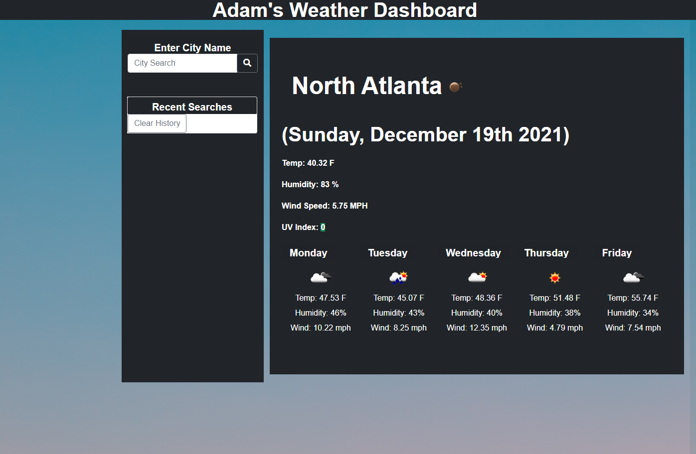

# My Weather App

A simple application to search a city and get the current and 5-day weather forecast. Using the OpenWeather Api. 
## Live Page
 
https://kovaceva11.github.io/MyWeatherDashboard/

## How It Works:
In the Search Field, enter any city name and it will populate the page with the current Date, Temp, Humidity, Wind Speed and UV Index. The UV index is color coded for Good (green), Moderate (orange) and Severe (red) for easy referencing.      

# Demo Page

# Credits

W3 Schools HTML & CSS Tutorials [https://www.w3schools.com/](www.w3schools.com)

MDN Web Docs [https://developer.mozilla.org/en-US/](Developer.Mozilla.Org)

Font Awesome [https://fontawesome.com/](www.fontawesome.com)

Open Weather API [https://openweathermap.org/api](openweatermap.org/api)

Bootstrap CSS Framework [https://getbootstrap.com/](https://getbootstrap.com/)

jQuery Javascript API [https://jquery.com/](https://jquery.com/)

# The Code
Click here to view the Github Repo for this simple Weather Dashboard! 
[https://github.com/Kovaceva11/MyWeatherDashboard](https://github.com/Kovaceva11/MyWeatherDashboard)

